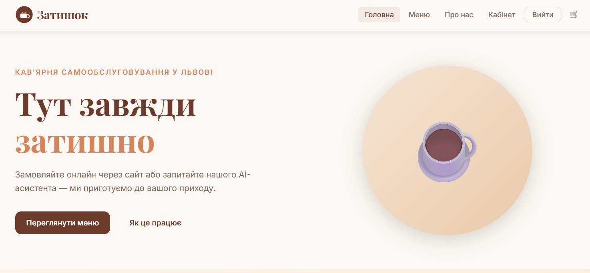
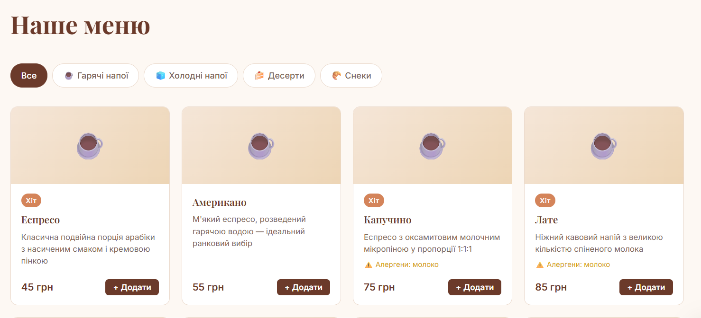
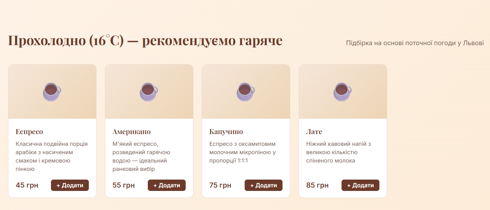
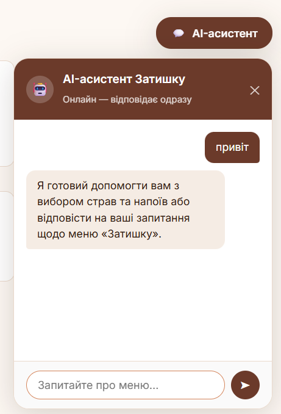

# Кав'ярня «Затишок» — вебплатформа з AI-чатботом

> Адаптивний вебзастосунок для кав'ярні з меню, системою замовлень та AI-асистентом на базі Google Gemini.

---

## 👤 Автор

- **ПІБ**: *Кожушко Ілона Романівна*
- **Група**: *Фес-42*
- **Керівник**: *Шувар Роман Ярославович*
- **Дата виконання**: *29.05.2026*

---

## Загальна інформація

- **Тип проєкту**: Вебсайт
- **Мова програмування**: Python 3.10+
- **Фреймворки / Бібліотеки**: Flask, Flask-SQLAlchemy, Werkzeug, google-generativeai, Requests

---

## Опис функціоналу

- Перегляд меню з фільтрацією за категоріями (Гарячі напої, Холодні напої, Десерти, Снеки)
- Кошик із можливістю додавання товарів вручну або через AI-чатбота
- Оформлення замовлень з відстеженням статусу (Прийнято → Готується → Готове → Видано)
- AI-чатбот на базі Google Gemini — радить страви, інформує про алергени, додає товари до кошика
- Погодний блок — рекомендує гарячі або холодні напої залежно від температури у Львові
- Реєстрація та авторизація користувачів
- Особистий кабінет з історією замовлень
- Адмін-панель — керування замовленнями та меню

---

## Опис основних файлів

| Файл | Призначення |
|------|-------------|
| `app.py` | Головний файл застосунку, всі маршрути та логіка |
| `models.py` | Моделі бази даних (Category, Product, User, Order, OrderItem) |
| `config.py` | Конфігурація: секретний ключ, URI бази даних, Gemini API ключ, координати |
| `seed_db.py` | Наповнення бази даних тестовими даними |
| `requirements.txt` | Список залежностей Python |

---

## Як запустити проєкт 

### 1. Встановлення інструментів

- Python 3.10+ — [python.org/downloads](https://www.python.org/downloads/)
- Під час встановлення поставте галочку **"Add Python to PATH"**

### 2. Клонування репозиторію

```bash
git clone https://github.com/your-user/zatyshok.git
cd zatyshok
```

### 3. Встановлення залежностей

```bash
pip install -r requirements.txt
```

### 4. Налаштування Gemini API

Відкрийте `config.py` і вставте свій ключ:

```python
GEMINI_API_KEY = 'ВАШ_КЛЮЧ_ТУТ'
```

Отримати безкоштовний ключ: [aistudio.google.com/app/apikey](https://aistudio.google.com/app/apikey)

### 5. Наповнення бази даних (перший запуск)

```bash
python seed_db.py
```

### 6. Запуск сервера

```bash
python app.py
```

### 7. Відкрити сайт

```
http://127.0.0.1:5000/
```

---

## Основні маршрути (API)

### Кошик

| Метод | Маршрут | Опис |
|-------|---------|------|
| `POST` | `/api/cart/add` | Додати товар до кошика |
| `POST` | `/api/cart/remove` | Видалити товар з кошика |
| `POST` | `/api/cart/clear` | Очистити кошик |

### Замовлення

| Метод | Маршрут | Опис |
|-------|---------|------|
| `POST` | `/api/order` | Оформити замовлення |
| `GET` | `/api/order-status/<id>` | Перевірити статус замовлення |

### Чатбот

**POST /api/chatbot**

```json
{
  "message": "Що порадите з холодного?",
  "history": []
}
```

**Response:**

```json
{
  "reply": "Рекомендую Айс Лате або Колд Брю — освіжаючі та бадьорі варіанти 🧊",
  "order_items": [],
  "cart_count": 0
}
```

---

## Інструкція для користувача

1. **Головна сторінка** — популярні позиції та погодні рекомендації напоїв
2. **Меню** (`/menu`) — перегляд усіх позицій з фільтром за категорією, додавання до кошика
3. **Чатбот** — натисніть іконку чату, запитайте про страви або скажіть *«додай капучино»*
4. **Кошик** — перегляньте обрані позиції та оформіть замовлення
5. **Кабінет** (`/profile`) — перегляд історії та статусу замовлень (після входу)
6. **Адмін-панель** (`/admin`) — керування замовленнями і меню (лише адміністратор)

---

## Тестові акаунти

| Роль | Email | Пароль |
|------|-------|--------|
| Адміністратор | admin@zatyshok.ua | admin123 |
| Користувач | user@zatyshok.ua | user123 |

---

## Скриншоти

### Головна сторінка


### Сторінка меню


### Рекомендація напоїв відносно погоди


### AI-чатбот у дії


---

## Типові проблеми та рішення

| Проблема | Рішення |
|----------|---------|
| `No module named flask` | Виконати `pip install -r requirements.txt` |
| `API key expired` | Оновити `GEMINI_API_KEY` у `config.py` |
| `Address already in use` | Порт 5000 зайнятий — закрити інший процес або змінити порт в `app.py` |
| Чатбот відповідає «недоступний» | Перевірити правильність API-ключа Gemini |
| Сайт не відкривається | Переконатись, що консоль із сервером запущена |

---

## Використані джерела

- [Flask документація](https://flask.palletsprojects.com/)
- [Flask-SQLAlchemy документація](https://flask-sqlalchemy.palletsprojects.com/)
- [Google Gemini API](https://ai.google.dev/)
- [Open-Meteo API](https://open-meteo.com/)
- [Werkzeug документація](https://werkzeug.palletsprojects.com/)
